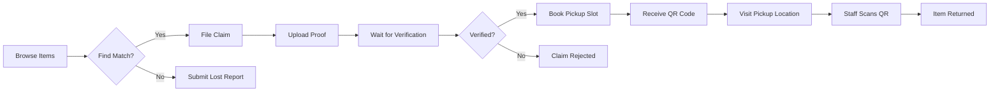
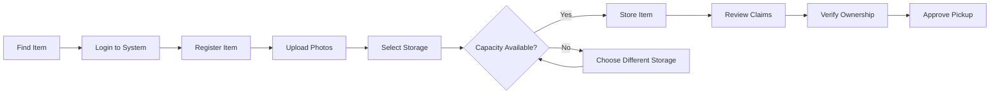

# Lost & Found Item Recovery Platform - Frontend

> **Developed by: Taniya Kamboj**


## 📖 Description

A full-stack system for organizations, transit authorities, or public venues to catalog lost items, allow owners to file claims, and manage the verification and return process with location-based matching.

This repository contains the **Frontend** application, built with React, TypeScript, and Tailwind CSS.

- **Frontend Repository:** [https://github.com/taniyakamboj15/LostAndFound-frontend.git](https://github.com/taniyakamboj15/LostAndFound-frontend.git)
- **Backend Repository:** [https://github.com/taniyakamboj15/LostAndFound-backend.git](https://github.com/taniyakamboj15/LostAndFound-backend.git)

## 🎯 Use Cases

- **Airports and Transit Authorities**: Managing passenger lost belongings.
- **Universities and Large Campuses**: Centralizing lost-and-found operations.
- **Hotels and Event Venues**: Handling guest forgotten items.

## ✨ Features

- **User Authentication**: Secure login/register for Admin, Staff, and Claimant roles.
- **Public Search Portal**: Browse found items without login requirement; view full item details publicly.
- **Found Item Registration**: Staff can log items with category, description, photos, and location/date found.
- **Lost Item Reports**: Owners can submit reports with identifying details to aid recovery.
- **Automated Matching Engine**: Suggests potential matches based on category, description keywords, and date/location proximity.
- **Claim Verification Workflow**: End-to-end process: Claim Filed → Identity Proof Requested → Verified → Returned.
  - **Enhanced UX**: "View Pickup Details" button appears on claim detail page when pickup is scheduled
  - Direct navigation from claim to associated pickup
- **Photo-Based Comparison**: Claimants can visually confirm ownership by asserting matches against found item photos.
- **Item Storage Tracking**: Manage shelf/bin locations with **automatic capacity enforcement**.
  - Visual occupancy indicators with color-coded progress bars
  - Prevents over-capacity additions
  - Real-time capacity updates
- **Handoff Scheduling**: Claimants can book time slots for item pickup; Staff verifies via QR/Reference code.
  - **New Calendar View**: Interactive monthly calendar showing all scheduled pickups
  - **Toggle Views**: Switch between List View and Calendar View seamlessly
  - **Smart Claimant Display**: Shows "You" for user's own pickups, claimant names for staff
  - Month-by-month navigation in Calendar View
- **Unclaimed Item Disposition**: Workflow to donate, auction, or dispose of items after the retention period expires.
- **Dashboard Analytics**: Insights on items reported, matched rates, average recovery time, and category breakdowns.
- **Notification System**: Alerts for potential matches, claim status updates, and retention expiry warnings.
- **Modular Architecture**: Clean separation of concerns with reusable components.
  - Header, Card, and Calendar components for Pickups
  - Centralized UI constants and type definitions
  - Custom hooks for business logic separation

## 🛠️ Tech Stack

- **Framework**: React 18 with TypeScript
- **Routing**: React Router v7
- **State Management**: Redux Toolkit
- **Styling**: Tailwind CSS, Framer Motion
- **Forms**: React Hook Form with Yup validation
- **HTTP Client**: Axios

## 📁 Project Structure

```bash
└── utils/          # Helper functions
```

## 👤 User Workflows

### Claimant Journey: Finding a Lost Item



**Step-by-Step:**
1. **Browse Public Catalog**: No login required to view found items
2. **File Claim**: Register/login to claim an item
3. **Upload Proof**: Submit ID and ownership evidence
4. **Verification**: Staff reviews and approves/rejects
5. **Schedule Pickup**: Choose convenient  time slot from calendar
6. **Pickup**: Present QR code or reference number at location
7. **Completion**: Item returned, claim marked complete

### Staff Workflow: Processing Found Items



**Step-by-Step:**
1. **Item Registration**: Enter details, category, location found, date
2. **Photo Upload**: Add multiple photos for better matching
3. **Storage Assignment**: System validates capacity before assignment
4. **Claim Review**: Review incoming claims with proof documents
5. **Verification**: Approve or reject based on evidence
6. **Pickup Management**: Verify QR codes and complete handoffs
7. **Analytics**: Track recovery rates and performance metrics

### Admin Workflow: System Management

```
1. User Management → Create/update staff accounts, manage roles
2. Storage Management → Add/edit storage locations, monitor capacity
3. Analytics Dashboard → View trends, export reports
4. Disposition Management → Handle unclaimed items (donate/auction/dispose)
5. System Configuration → Pickup slots, retention periods, notification templates
```

## 🎨 Component Architecture

### Design System Hierarchy

```
src/components/
├── ui/                    # Core reusable UI components
│   ├── Button.tsx         # Primary, secondary, ghost variants
│   ├── Card.tsx           # Container with hover effects
│   ├── Badge.tsx          # Status indicators
│   ├── Modal.tsx          # Dialog/overlay system
│   ├── Input.tsx          # Form inputs with validation
│   └── Spinner.tsx        # Loading states
│
├── feedback/              # User feedback components
│   ├── ErrorBoundary.tsx  # Error handling
│   ├── Toast.tsx          # Notifications
│   └── EmptyState.tsx     # No data placeholders
│
├── layout/                # Page structure
│   ├── Navbar.tsx         # Top navigation
│   ├── Sidebar.tsx        # Admin side menu
│   └── Footer.tsx         # Page footer
│
├── items/                 # Item-specific components
│   ├── ItemCard.tsx       # Item preview card
│   ├── ItemFilters.tsx    # Search/filter UI
│   └── PhotoGallery.tsx   # Image carousel
│
├── claims/                # Claim-specific components
│   ├── ClaimCard.tsx      # Claim list item
│   ├── ProofUpload.tsx    # Document upload
│   └── ScanPickupModal.tsx # QR verification
│
└── pickups/               # Pickup-specific components
    ├── PickupsHeader.tsx  # Page header with actions
    ├── PickupCard.tsx     # Individual pickup display
    └── CalendarView.tsx   # Calendar grid with navigation
```

### State Management Strategy

- **Redux Toolkit**: Global state for auth, user profile
- **React Router Loaders**: Server-side data fetching
- **Custom Hooks**: Component-specific logic (usePickupVerification, useStorageOperations)
- **React Hook Form**: Form state and validation
- **Local State**: UI toggles, modal visibility

### Routing Architecture

```typescript
// Public Routes (no auth required)
/                  → Home (ItemsList)
/items/:id         → ItemDetail

// Protected Routes (authentication required)
/claims            → ClaimsList
/claims/:id        → ClaimDetail
/pickups           → PickupsList (with calendar/list toggle)
/pickups/:id       → PickupDetail
/lost-reports      → LostReportsList
/lost-reports/:id  → LostReportDetail

// Staff/Admin Routes
/storage           → StorageList
/analytics         → Dashboard
/admin/staff       → AdminStaff
/dispositions      → DispositionList
```


## 🚀 Installation & Setup

1.  **Clone the repository**
    ```bash
    git clone https://github.com/taniyakamboj15/LostAndFound-frontend.git
    cd LostAndFound-frontend
    ```

2.  **Install dependencies**
    ```bash
    npm install
    ```

3.  **Configure Environment**
    Create a `.env` file in the root directory:
    ```env
    VITE_API_URL=http://localhost:5000
    ```

4.  **Start Development Server**
    ```bash
    npm run dev
    ```

    npm run build
    ```

## 🆕 Recent Updates (February 2026)

### Today's Updates (February 17, 2026) 🔥

> **View all changes:** Checkout the `today_update` branch to see all of today's improvements in detail.

#### Code Architecture & Refactoring
- ✅ **Custom Hooks Pattern**: Extracted all business logic into reusable custom hooks
  - `useProofUpload`: Manages proof document upload flow
  - `useEmailVerification`: Handles async email verification
  - `usePickupVerification`: QR code scanning and verification
  - `useStorageOperations`: Storage capacity calculations and utilities
  - `usePhotoUpload`: Reusable photo upload logic with validation
- ✅ **Presentational Components**: All components refactored to be "dumb" UI-only functions
  - No business logic in components
  - Easy to test and debug
  - Clear separation of concerns
- ✅ **Switch → Map Pattern**: Replaced all switch statements with map-based configurations
  - Status badge configurations in constants
  - Route definitions as maps
  - Cleaner, more maintainable code
- ✅ **Type Centralization**: All TypeScript types moved to dedicated type files
  - `pickup.types.ts`, `storage.types.ts`, `claim.types.ts`, etc.
  - Shared types exported from single source of truth
  - No type duplication across files
- ✅ **Constants Organization**: UI constants, routes, feedback messages all centralized
  - `constants/ui.ts`: All UI configurations
  - `constants/routes.ts`: Route definitions
  - `constants/feedback.ts`: User messages and document types
- ✅ **Comment Removal**: All unnecessary comments removed
  - Code is self-documenting
  - Function and variable names clearly express intent

#### Documentation Excellence
- ✅ **Comprehensive Workflows**: User journey diagrams with mermaid
- ✅ **Component Architecture**: Full component hierarchy documented
- ✅ **State Management**: Strategy and patterns explained
- ✅ **Future Roadmap**: 8+ planned features with timelines

### Pickup UX Enhancements
- ✅ **Calendar View for Pickups**: Interactive monthly calendar showing all scheduled pickups with month navigation
- ✅ **List/Calendar Toggle**: Seamlessly switch between traditional list view and visual calendar view
- ✅ **Smart Claimant Labels**: Displays "You" for user's own pickups; shows claimant names for staff/admin
- ✅ **Pickup-Claim Integration**: Direct "View Pickup Details" button on claim detail page when pickup is scheduled
- ✅ **Month Navigation**: Navigate through past and future months in Calendar View

### Component Refactoring
- ✅ **Modular Pickup Components**: Split `PickupsList` into three focused components:
  - `PickupsHeader`: Header with conditional "Verify Pickup" button for staff/admin
  - `PickupCard`: Reusable card component for displaying individual pickup details
  - `CalendarView`: Standalone calendar component with month navigation and pickup highlighting
- ✅ **Centralized Constants**: UI constants and configurations moved to `src/constants/ui.ts`
- ✅ **Type Safety**: Enhanced TypeScript definitions in `src/types/pickup.types.ts`

### Storage Management UI
- ✅ **Real-time Capacity Tracking**: Visual occupancy indicators with color-coded progress bars
- ✅ **Capacity Validation Feedback**: Clear error messages when attempting to exceed storage capacity
- ✅ **Accurate Display**: Synchronized with backend capacity management for real-time accuracy

### Navigation & Accessibility
- ✅ **Public Access**: Home page (Lost & Found browser) accessible without login
- ✅ **Smart Routing**: Conditional navigation items based on user role and authentication status
- ✅ **Admin Navigation**: Enhanced navbar with Analytics, Storage, and Staff links for administrators
- ✅ **Standardized Back Button**: Consistent navigation across all detail pages

### Code Quality & Architecture
- ✅ **Custom Hooks**: Business logic extracted into reusable hooks (e.g., `useStorageOperations`, `usePickupVerification`)
- ✅ **Component Organization**: Clear separation between presentational and container components
- ✅ **Error Boundaries**: Robust error handling with user-friendly fallback UIs
- ✅ **Performance Optimizations**: Memoized calculations and optimized re-renders

## 🚀 Future Enhancements

### Planned Features

#### 1. **Progressive Web App (PWA)**
- Offline support for browsing previously viewed items
- Add to home screen capability
- Push notifications for claim updates
- Service worker for caching strategies
- Estimated Timeline: 2-3 weeks

#### 2. **Advanced Search & Filters**
- Multi-faceted filtering (date range, location, multiple categories)
- Saved search preferences
- Search history and recent views
- Fuzzy search with typo tolerance
- Visual filters (color, size sliders)

#### 3. **Real-Time Updates**
- WebSocket integration for live notifications
- Real-time pickup calendar updates
- Live chat support with staff
- Instant claim status changes without refresh

#### 4. **Enhanced Accessibility (WCAG 2.1 AA)**
- Complete keyboard navigation
- Screen reader optimization
- High contrast mode
- Reduced motion support
- Multilingual support (i18n)

#### 5. **Interactive Data Visualizations**
- D3.js charts for analytics dashboard
- Recovery rate trends over time
- Category distribution pie charts
- Geographic heatmaps of found items
- Staff performance leaderboards

#### 6. **Mobile-Optimized Features**
- Touch gestures for photo swiping
- Camera integration for proof upload
- GPS-based location suggestions
- Biometric authentication support

#### 7. **Social Features**
- Share lost item alerts on social media
- Public success stories wall
- Testimonials and ratings system
- Community forum for tips

#### 8. **AI-Powered Enhancements**
- Image recognition for auto-categorization
- Chatbot for claimant assistance
- Smart recommendations based on lost reports
- Predictive text for item descriptions

### UI/UX Improvements

- **Dark Mode**: System-wide theme toggle with persisted preference
- **Customizable Dashboard**: Drag-and-drop widget arrangement for admins
- **Skeleton Loaders**: Better loading states instead of spinners
- **Micro-interactions**: Delightful animations for actions (like, claim, pickup)
- **Guided Tours**: First-time user onboarding with tooltips
- **Responsive Tables**: Better mobile experience for data-heavy pages

### Technical Optimizations

- **Code Splitting**: Route-based lazy loading for faster initial load
- **Image Optimization**: WebP format with fallbacks, lazy loading
- **Bundle Size Reduction**: Tree shaking, dynamic imports
- **A/B Testing Framework**: Experiment with UI variations
- **Performance Monitoring**: Integrate Sentry or LogRocket
- **End-to-End Testing**: Playwright/Cypress test suites

Contributions are welcome! Please fork the repository and submit a pull request.

## 📄 License

This project is licensed under the MIT License.
```
